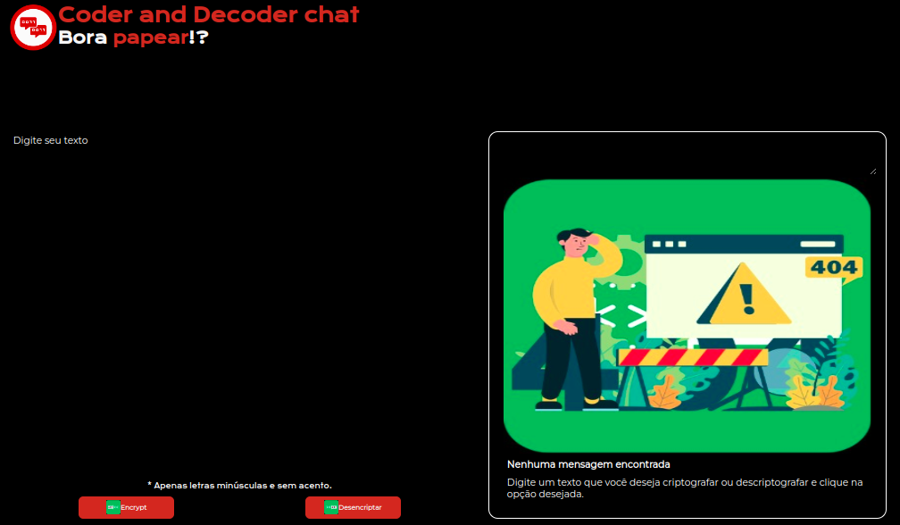
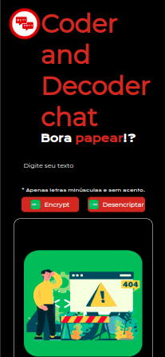
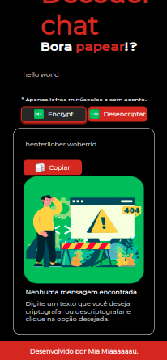

<h2 align="center">🤖Codificador e decodificador de textos🤖 </h2>

<h4 align="justify">
Desafio de desenvolver um decodificador de texto proposto pela <a href="https://www.alura.com.br/challenges/challenge-one-logica/sprint01-construa-decodificador-texto-com-javascript">Oracle Next Education + Alura</a>, utilizando o aprendizado em lógica de programação do primeiro módulo com HTML, CSS e Javascript sem o uso de frameworks, conforme wireframe desenvolvido no figma (<a href="https://www.figma.com/design/tvFEYhVfZTjdJ5P24RGV21/Alura-Challenge---Desafio-1---L%C3%B3gica?node-id=0-1&t=55rmbGC5mz17kRYS-0">Figma</a>).
<h4/>

<h3 align="center"> Sumário  </h3>

<h3 align="center"> 

[💻Projeto](#como-rodar-o-projeto-localmente) | [📚Bibliotecas](#bibliotecas-utilizadas) | 
[🛠️Tecnologias](#tecnologias-utilizadas) | [👩🏻‍💻Equipe de Dev](#equipe-desenvolvedora) | [🖥️📱Imagens](#imagens) 

<h3/>

## ✔O que funciona
- Inserção de texto em input que fica vermelho ao colocar o mouse em cima.
- Aceita apenas letras minúsculas e sem acentos.
- Imagem de ausência de texto quando não há nada digitado.
- Imagem de ausência de texto some quando pedido para codificar ou decodificar alguns conteúdo (existente, não apenas ou clicar nos botões). 
- Botão de copiar o texto resultado.
- Responsividade para mobile.

## 🔗Link Surge
Não aplicável

## 💻Como rodar o projeto localmente
Siga o passo-a-passo abaixo:

| Passo                     | Comando            |
| ------------------------- | ------------------ |
| Faça o Clone              | `git clone`        |
| Instale as Dependências   | `npm install`      |
| Utilize o Script Start    | `npm start`        |

Por padrão a aplicação rodará localmente na porta 3000.

## 📚Bibliotecas utilizadas
- Nenhuma devido a pré-requisito da Oracle One

## 🛠Tecnologias utilizadas
 
 
  
  
  
  

## 👩🏻‍💻Equipe desenvolvedora 
<a href="https://github.com/JilMayumiMoutinho"> <b>Jil Mayumi Moutinho</b></a>

## 🖥📱Imagens
 Página de login para tela desk 

